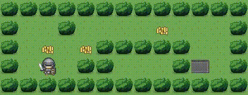

# 🐬 So Long - 2D Game with MiniLibX  

**42 Firenze Project | Computer Graphics**  
*Gioco 2D in stile puzzle/avventura con gestione mappe, collezionabili e percorsi*  

---

## 📜 Cosa Richiede il Progetto (Mandatory Part)  

### 🎯 Obiettivi Principali  
- Creare un gioco 2D con **MiniLibX** dove:  
  - Il giocatore raccoglie tutti i collezionabili (`C`)  
  - Trova l'uscita (`E`)  
  - Evita i muri (`1`)  
- Parsing di mappe in formato `.ber` con:  
  - Formato rettangolare  
  - Muri perimetrali chiusi  
  - Almeno 1 `P`, 1 `E`, 1 `C`  

### ⚙️ Funzionalità Richieste  
- **Controlli**:  
  - Movimento con `WASD`  
  - Count dei passaggi in terminale  
  - Uscita con `ESC` o click sulla X  
- **Grafica**:  
  - Texture per ogni elemento (muri, player, etc.)  
  - Finestra responsive (minimizza/ripristina)  

---

## 🎥 Demo


## 🛠️ Installazione & Utilizzo  
```bash
git clone https://github.com/mttgvnrd/so_long.git
cd so_long
make  # Compila il progetto

# Esegui con una mappa
./so_long maps/map1.ber
